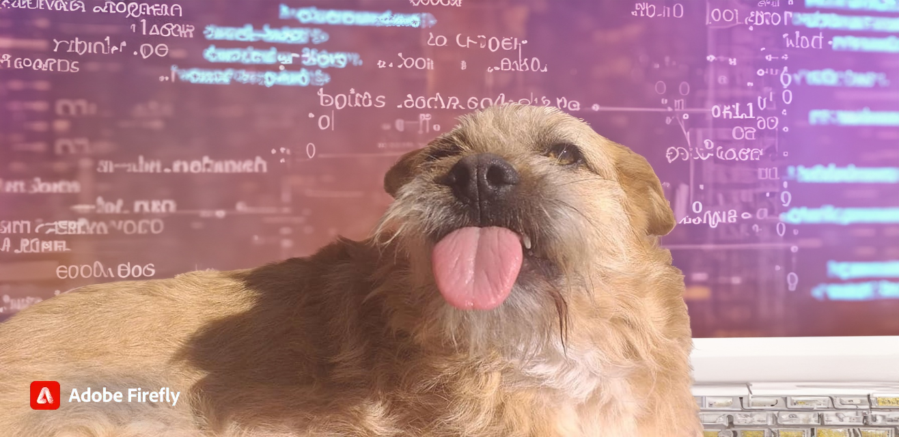
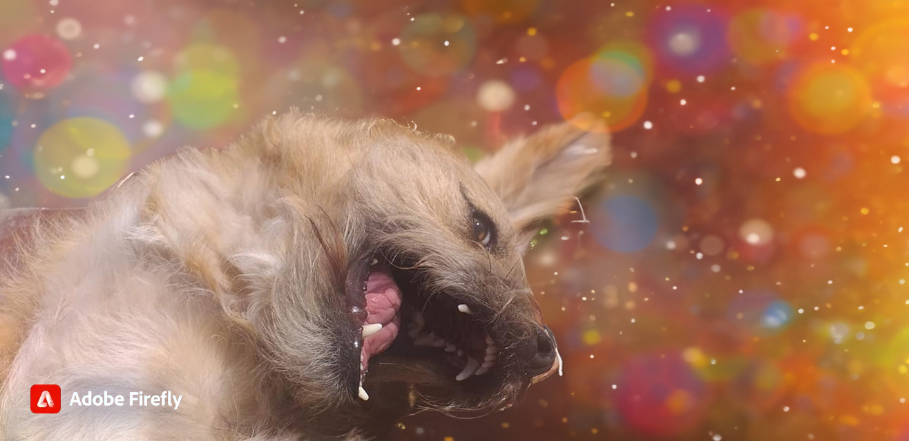

# ¡Hola, soy @HectorDanielAyarachiFuentes! 👋

¡Bienvenido a mi perfil de GitHub!

## Sobre Mí
- 👀 Estoy interesado en la programación, la tecnología y la innovación.
- 🌱 Actualmente estoy aprendiendo nuevas tecnologías y mejorando mis habilidades de desarrollo.
- 💞️ Estoy buscando colaborar en proyectos interesantes y desafiantes.
- 📫 Puedes contactarme a través de mi correo electrónico: [mp4o@hotmail.com](mailto:mp4o@hotmail.com)

## Sobre mi GitHub
- 🔭 Aquí encontrarás una variedad de proyectos, desde aplicaciones web hasta juegos y más.
- 🌐 Explora mis repositorios y descubre lo que he estado construyendo.
- 🤝 ¡Siéntete libre de colaborar en mis proyectos o iniciar una conversación!

¡Gracias por visitar mi perfil! 😊

## 🖥️ Programando 🖥️
-  Java
-  HTML
-  CSS
-  JavaScript
-  Bootstrap
-  React
-  Vue.js

## ✅ Contactos ✅
- 
- 
- 
- 
- 
- 
