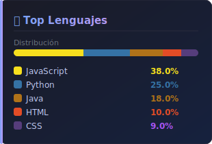
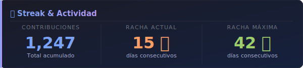

<!-- ══════════════════════════════════════════ -->
<!--              ANIMATED BANNER              -->
<!-- ══════════════════════════════════════════ -->

  

<!-- Animated typing -->

  

 

<!-- ══════════════════════════════════════════ -->
<!--            QUICK CONNECT BADGES           -->
<!-- ══════════════════════════════════════════ -->

&nbsp;
&nbsp;

---

<!-- ══════════════════════════════════════════ -->
<!--                ABOUT ME                   -->
<!-- ══════════════════════════════════════════ -->

## 👨‍💻 Sobre Mí

> *"El código es poesía escrita en lógica — y cada función bien diseñada es un verso perfecto."*

Soy un **Desarrollador de Software** de Argentina con un enfoque profundo en arquitecturas modernas y experiencias de usuario que realmente importan. En **2026**, mi misión es estar siempre un paso adelante: construyendo con IA, diseñando para personas y contribuyendo a un ecosistema open-source más fuerte.

<table border="0" style="border: none;">
<tr style="background: transparent;">
<td width="50%" style="border: none; vertical-align: top;">

🎯 **Enfoque actual:** Agentes IA y arquitecturas web modernas  
🚀 **Buscando colaborar** en proyectos open-source desafiantes  
🌱 **Aprendiendo:** LLMs, RAG y Deployment escalable  
🌍 **Ubicación:** Argentina

</td>
<td width="50%" style="border: none; vertical-align: top;">

💡 **Intereses:** Tech · IA · Diseño · Innovación  
📫 **Contacto:** [mp4o@hotmail.com](mailto:mp4o@hotmail.com)  
💬 **Pregúntame sobre:** Cualquier cosa tech  
⚡ **Fun fact:** Mi mejor revisora de código tiene cuatro patas 🐾

</td>
</tr>
</table>

---

<!-- ══════════════════════════════════════════ -->
<!--              TECH STACK                   -->
<!-- ══════════════════════════════════════════ -->

## 🛠️ Arsenal Tecnológico

### 🎨 Frontend & Diseño

  &nbsp;
  &nbsp;
  &nbsp;
  &nbsp;
  &nbsp;
  

### ⚙️ Backend & Datos

  &nbsp;
  &nbsp;
  &nbsp;
  

### 🔧 Herramientas & DevOps

  &nbsp;
  &nbsp;
  &nbsp;
  

---

<!-- ══════════════════════════════════════════ -->
<!--           FEATURED PROJECTS               -->
<!-- ══════════════════════════════════════════ -->

## 🌟 Proyectos Destacados

<table border="0" style="border-collapse: collapse; width: 100%;">
<tr style="background: transparent;">

<td width="50%" style="padding: 10px; border: none; vertical-align: top;">

### 🚀 Proyecto Antigravity
Editor de código inteligente personalizado con soporte de IA, TTS con resaltado de texto en tiempo real y un diseño previsualizador moderno.

**Stack:** `JavaScript` · `VS Code Extension` · `Node.js`

</td>

<td width="50%" style="padding: 10px; border: none; vertical-align: top;">

### 💡 Web Dashboard
Dashboard interactivo con widgets dinámicos, modo oscuro, notas sticky, reloj y pantallas personalizadas de bienvenida.

**Stack:** `HTML` · `CSS` · `JavaScript` · `SVG`

</td>

</tr>
</table>

---

<!-- ══════════════════════════════════════════ -->
<!--             GITHUB METRICS                -->
<!-- ══════════════════════════════════════════ -->

## 📊 Métricas de Desarrollo

  
  &nbsp;&nbsp;
  

 

  

---

<!-- ══════════════════════════════════════════ -->
<!--        CONTRIBUTION ACTIVITY              -->
<!-- ══════════════════════════════════════════ -->

## 🐍 Actividad — Contribution Snake

  <picture>
    <source media="(prefers-color-scheme: dark)" srcset="https://raw.githubusercontent.com/HectorDanielAyarachiFuentes/HectorDanielAyarachiFuentes/output/github-contribution-grid-snake-dark.svg">
    <source media="(prefers-color-scheme: light)" srcset="https://raw.githubusercontent.com/HectorDanielAyarachiFuentes/HectorDanielAyarachiFuentes/output/github-contribution-grid-snake.svg">
    
  </picture>

  

---

<!-- ══════════════════════════════════════════ -->
<!--              DULCE REINA                  -->
<!-- ══════════════════════════════════════════ -->

  

 

  <table border="0" style="border-collapse: collapse; background: transparent;">
    <tr style="background: transparent;">
      <td style="padding: 10px; border: none; vertical-align: top;">
        
         <b>👑 La Reina</b>
      </td>
      <td style="padding: 10px; border: none; vertical-align: top;">
        
         <b>💜 La Experta</b>
      </td>
      <td style="padding: 10px; border: none; vertical-align: top;">
        
         <b>⭐ La MVP</b>
      </td>
    </tr>
  </table>

---

<!-- ══════════════════════════════════════════ -->
<!--                FOOTER                     -->
<!-- ══════════════════════════════════════════ -->

### 📬 ¿Hablamos?

¿Tienes un proyecto interesante, una idea loca o simplemente quieres conectar?  
**¡No dudes en escribirme!** Siempre estoy abierto a nuevas conversaciones.

 

&nbsp;
&nbsp;

 

 

*Made with ❤️ · Neuquén · Patagonia · Argentina · 2026*

 

  

