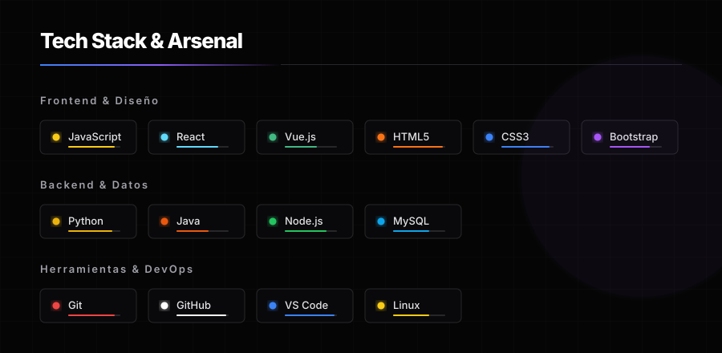
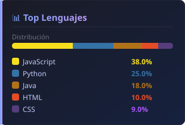
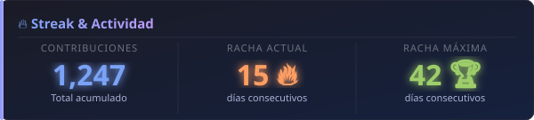
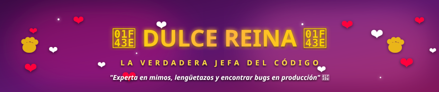

<div align="center">

<!-- HEADER SECTION -->

<br/><br/>

<br/><br/>

<a href="https://github.com/HectorDanielAyarachiFuentes"><kbd>&nbsp;  GitHub &nbsp;</kbd></a>&nbsp;&nbsp;
<a href="https://codepen.io/HectorDanielAyarachiFuentes"><kbd>&nbsp; ✒️ CodePen &nbsp;</kbd></a>&nbsp;&nbsp;
<a href="mailto:mp4o@hotmail.com"><kbd>&nbsp; 📧 Contacto &nbsp;</kbd></a>

<br/><br/>

</div>

---

### 👨‍💻 `init_profile.js`

```javascript
/**
 * @developer Hector Daniel Ayarachi Fuentes
 * @location Neuquén, Patagonia, Argentina 🇦🇷
 */

const Developer = {
  role: "Software Developer",
  mission: "El código es poesía escrita en lógica — y cada función bien diseñada es un verso perfecto.",
  focus: ["Agentes IA", "Herramientas de desarrollo", "Arquitecturas Web"],
  learning: ["LLMs", "RAG", "Sistemas de Agentes", "Deployment Escalable"],
  funFact: "Mi mejor revisora de código tiene cuatro patas 🐾",
  execute: () => {
    return "Construyendo con IA, diseñando para personas.";
  }
};
```

<div align="center">
  <br/>
  
</div>

---

### 📂 `~/projects/showcase`

<details>
  <summary><b>▸ 🚀 Proyecto Antigravity (Terminal IDE)</b></summary>
  <br/>
  <blockquote>
    Editor de código inteligente personalizado con soporte de IA, TTS con resaltado de texto en tiempo real y un diseño previsualizador moderno.<br/><br/>
    <b>Stack:</b> <code>JavaScript</code> · <code>VS Code Extension</code> · <code>Node.js</code><br/><br/>
    <a href="https://github.com/HectorDanielAyarachiFuentes"><kbd>Ver Repositorio</kbd></a>
  </blockquote>
</details>

<details>
  <summary><b>▸ 💡 Web Dashboard (Frontend Interactive)</b></summary>
  <br/>
  <blockquote>
    Dashboard interactivo con widgets dinámicos, modo oscuro, notas sticky, reloj y pantallas personalizadas de bienvenida.<br/><br/>
    <b>Stack:</b> <code>HTML</code> · <code>CSS</code> · <code>JavaScript</code> · <code>SVG</code><br/><br/>
    <a href="https://codepen.io/HectorDanielAyarachiFuentes"><kbd>Ver CodePen</kbd></a>
  </blockquote>
</details>

<br/>

---

### 📈 `system_metrics.sh`

<br/>
<b>▸ 📊 Dashboard de Rendimiento (CPU/Commits)</b>
<br/><br/>
<div align="center">
    
    
    <br/><br/>
    
    <br/><br/>
    <picture>
      <source media="(prefers-color-scheme: dark)" srcset="https://raw.githubusercontent.com/HectorDanielAyarachiFuentes/HectorDanielAyarachiFuentes/output/github-contribution-grid-snake-dark.svg">
      <source media="(prefers-color-scheme: light)" srcset="https://raw.githubusercontent.com/HectorDanielAyarachiFuentes/HectorDanielAyarachiFuentes/output/github-contribution-grid-snake.svg">
      
    </picture>
    <br/><br/>
    
</div>

<br/>
<b>▸ 🌍 Análisis de Comunidad (Redes & Seguidores)</b>
<br/><br/>
<div align="center">
    <a href="https://info.flagcounter.com/hRps">
      
    </a>
    <br/><br/>
    
    <p><i>Ubicación geográfica de la comunidad de desarrolladores.</i></p>
  </div>

<br/>

---


### 🐾 `QA_Department/Dulce_Reina`


<div align="center">
  
  <br/><br/>
  <p>La mejor inspectora de calidad de código de toda la Patagonia.</p>
</div>

<table align="center" style="border: none;">
  <tr>
    <td align="center" width="33%">
      
      <br/><br/>
      
    </td>
    <td align="center" width="33%">
      
      <br/><br/>
      
    </td>
    <td align="center" width="33%">
      
      <br/><br/>
      
    </td>
  </tr>
</table>

<br/>

---

### 📡 `ping --contact user`

<div align="center">

Si tienes un proyecto interesante o simplemente quieres conectar, la terminal siempre está abierta.

<br/>

<a href="https://github.com/HectorDanielAyarachiFuentes"><kbd>&nbsp;  Seguir en GitHub &nbsp;</kbd></a>&nbsp;&nbsp;
<a href="https://codepen.io/HectorDanielAyarachiFuentes"><kbd>&nbsp; ✒️ Seguir en CodePen &nbsp;</kbd></a>&nbsp;&nbsp;
<a href="mailto:mp4o@hotmail.com"><kbd>&nbsp; 📧 Enviar Mail &nbsp;</kbd></a>

<br/><br/><br/>


<br/>

<code>EOF - Made with ❤️ in Neuquén, Patagonia, Argentina (2026)</code>

<br/><br/>



</div>
