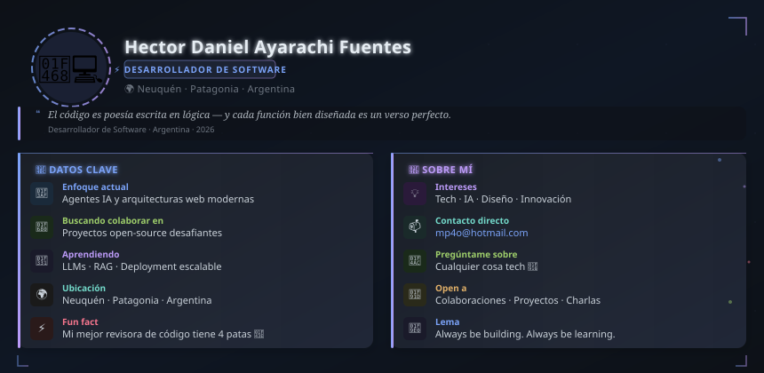

<!-- HERO SECTION -->

  

  

  

<!-- ABOUT ME & TECH STACK -->

  <i>"El código es poesía escrita en lógica — y cada función bien diseñada es un verso perfecto."</i>

Soy un **Desarrollador de Software** de Argentina con un enfoque profundo en arquitecturas modernas y experiencias de usuario que realmente importan. En **2026**, mi misión es estar siempre un paso adelante: construyendo con IA, diseñando para personas y contribuyendo a un ecosistema open-source más fuerte.

 

<table>
  <tr>
    <td valign="top" width="50%" align="left">
      🎯 <b>Enfoque actual:</b> Agentes IA, herramientas de desarrollo y arquitecturas web.  
      🚀 <b>Buscando colaborar</b> en proyectos open-source desafiantes e ideas innovadoras.
    </td>
    <td valign="top" width="50%" align="left">
      🌱 <b>Aprendiendo:</b> LLMs, RAG, sistemas de agentes y Deployment escalable.  
      ⚡ <b>Fun fact:</b> Mi mejor revisora de código tiene cuatro patas 🐾
    </td>
  </tr>
</table>

  

  

<!-- FEATURED PROJECTS -->
<h2>🌟 Proyectos Destacados</h2>

<table border="0" style="border-collapse: collapse; width: 100%;">
  <tr style="background: transparent;">
    <td width="50%" style="padding: 15px; border: none; vertical-align: top;">
      

        <h3 style="margin-top: 0;">🚀 Proyecto Antigravity</h3>
        
Editor de código inteligente personalizado con soporte de IA, TTS con resaltado de texto en tiempo real y un diseño previsualizador moderno.

        
<b>Stack:</b> <code>JavaScript</code> · <code>VS Code Extension</code> · <code>Node.js</code>

        
      

    </td>
    <td width="50%" style="padding: 15px; border: none; vertical-align: top;">
      

        <h3 style="margin-top: 0;">💡 Web Dashboard</h3>
        
Dashboard interactivo con widgets dinámicos, modo oscuro, notas sticky, reloj y pantallas personalizadas de bienvenida.

        
<b>Stack:</b> <code>HTML</code> · <code>CSS</code> · <code>JavaScript</code> · <code>SVG</code>

        
      

    </td>
  </tr>
</table>

  

<!-- GITHUB ANALYTICS & ACTIVITY -->
<h2>🚀 GitHub Analytics & Activity Dashboard</h2>

  

  

<picture>
  <source media="(prefers-color-scheme: dark)" srcset="https://raw.githubusercontent.com/HectorDanielAyarachiFuentes/HectorDanielAyarachiFuentes/output/github-contribution-grid-snake-dark.svg">
  <source media="(prefers-color-scheme: light)" srcset="https://raw.githubusercontent.com/HectorDanielAyarachiFuentes/HectorDanielAyarachiFuentes/output/github-contribution-grid-snake.svg">
  
</picture>

  

  

<h3>🌍 Comunidad Global</h3>

  

<i>Ubicación geográfica de la comunidad de desarrolladores que siguen mi trabajo.</i>

  

<!-- VIP SECTION: DULCE REINA -->

  

<table border="0" style="border-collapse: collapse; background: transparent; width: 100%;">
  <tr style="background: transparent;">
    <td style="padding: 15px; border: none; vertical-align: top; text-align: center; width: 33%;">
      
        <h3>👑 La Reina</h3>
    </td>
    <td style="padding: 15px; border: none; vertical-align: top; text-align: center; width: 33%;">
      
        <h3>💜 La Experta</h3>
    </td>
    <td style="padding: 15px; border: none; vertical-align: top; text-align: center; width: 33%;">
      
        <h3>⭐ La MVP</h3>
    </td>
  </tr>
</table>

  

<!-- FOOTER -->
<h2>📬 ¿Hablamos?</h2>

¿Tienes un proyecto interesante, una idea loca o simplemente quieres conectar? <b>¡No dudes en escribirme!</b> Siempre estoy abierto a nuevas conversaciones.

 

  

  

<i>Made with ❤️ · Neuquén · Patagonia · Argentina · 2026</i>

